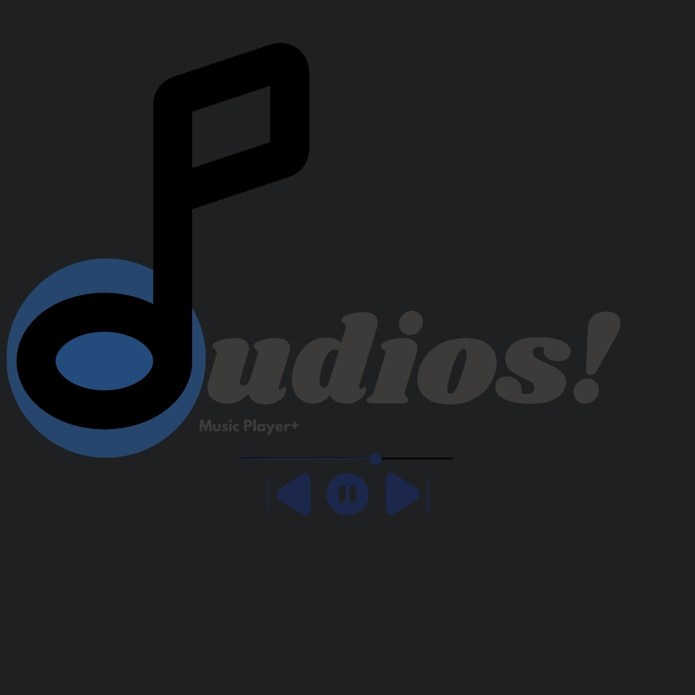

  

<h1 align="center">Audios!</h1>

  A Linux music player, finder, and metadata editor. 
  Local libraries, YouTube search via yt-dlp, tag editing, and custom EQ profiles.

  <a href="docs/features.md">Features</a> ·
  <a href="docs/architecture.md">Architecture</a> ·
  <a href="CONTRIBUTING.md">Contributing</a> ·
  <a href="https://github.com/nnapkin12/AudiosPlayer/wiki">Wiki</a> ·
  <a href="LICENSE">MIT</a>

  GitHub: <a href="https://github.com/nnapkin12/AudiosPlayer">AudiosPlayer</a>

## Quick Intro

Audios! is a Linux music player for local files, or building your collection. Open a file or a nested album tree, queue it, and play. Search uses [yt-dlp](https://github.com/yt-dlp/yt-dlp) to list YouTube results, then caches a temp file for playback (deleted when the track changes) or saves a copy. The Tags tab edits metadata and artwork. Settings includes built-in themes and a theme builder.

It is built with Rust and a React UI hosted by [Tauri](https://tauri.app/).

It is **not** a Spotify client. Search cannot pull Spotify-hosted audio.

## Features

- **Music Player** — Playlists, nested albums, queue, repeat, shuffle, gapless, ReplayGain, and an app-wide graphic EQ. Library folders, and folders added to a playlist, follow the disk when songs are added or removed. Playlists are named lists with a custom picture, otherwise a mosaic from track artwork. Library and playlist lists have their own search bars.
- **Search** — query by song and artist, or paste a link. Text search lists YouTube and SoundCloud. Results show thumbnails. Play uses a temp file that is deleted on track change; Download keeps a copy.
- **Metadata Editor** — title, artists, album, lyrics, ReplayGain, MusicBrainz IDs, custom fields, artwork (including Find artwork), and batch apply across a folder. Save stays on screen, and saved tags show up in the player immediately.
- **Themes** — Dusk, Midnight, Slate, Paper, plus a theme builder with simple grouped colors and Advanced per-token edits.

A longer list lives in [docs/features.md](docs/features.md).

## Releases

GitHub Release assets are  two installer files, Music Search still needs a **host** (installed yt-dlp, ffmpeg, and curl); they are not inside the package.

## License

[MIT](LICENSE). Logo marks: [CREDITS.md](CREDITS.md).
